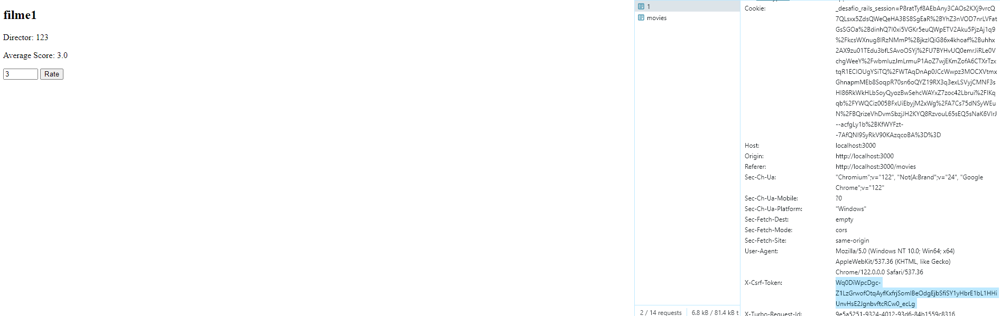
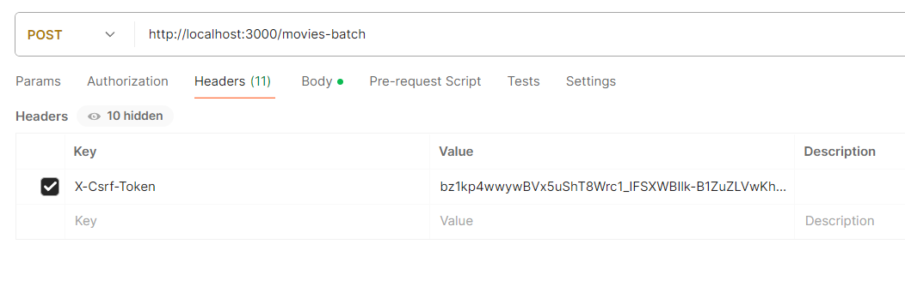
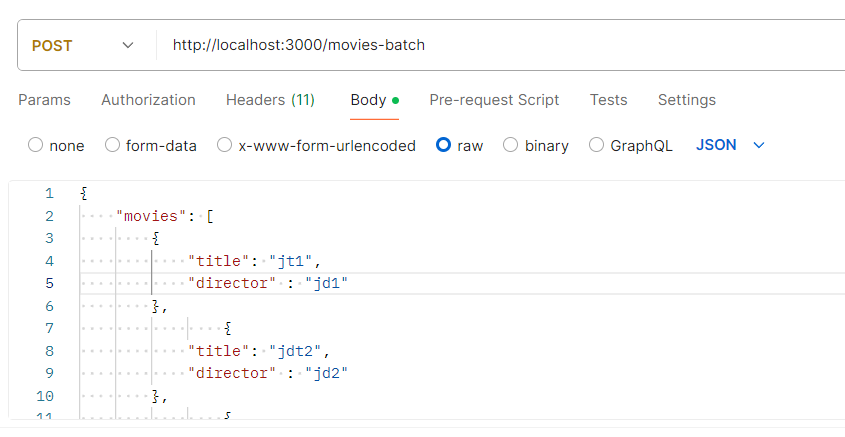
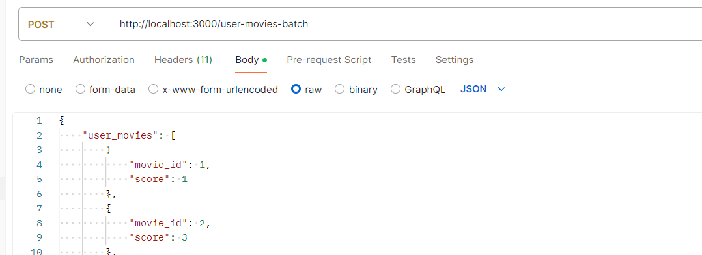
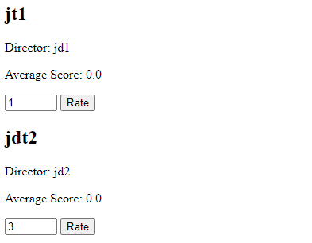

# movies-oxean

## Requerimentos
- [redis](https://redis.io/docs/install/install-redis/)
- ruby-3.1.4
- sqlite3

## Setup
    bundle install
    rails db:migrate
    rails db:seed

## Etapas de execução

Em um terminal rode

    rails s

E em outro

    bundle exec sidekiq

## Accessing the routes

Com isso teremos duas rotas

- /movies-batch 
- /user-movies-batch 

Usuário padrão: admin@rotten e senha admin

Para conseguir ter acesso ao token de autenticação abra a aba de ferramentas de desenvolvedor do seu navegador e execute uma alteração qualquer de avaliação de um filme. Com isso voce vai ter acesso a um token de acesso "X-Csrf-Token", para usar no Header das requisições para API como mostra as imagems seguinte (Usando o [Postman](https://www.postman.com/downloads/)) 

Com isso você poderá criar filmes em massa com a rota /movies-batch

E atribuir notas, em massa, para os filmes

## Novas rotas e jobs

Os arquvivos principais para se entender as alterações feitas são: 
- movies_controller.rb
- user_movies_controller.rb
- batch_job.rb
- create_movie_batch_job.rb